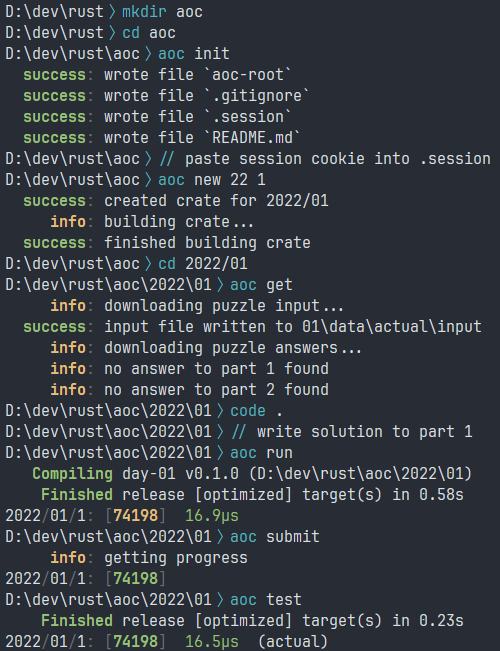

# aocli

A helper CLI tool for solving [Advent of Code](https://adventofcode.com) in Rust.
Uses [aocli-runner](https://github.com/scjqt/aocli-runner) to run solutions.

## Installation
```
cargo install --git https://github.com/scjqt/aocli
```

The binary name for aocli is `aoc`.

## Requirements
- `cargo` is in PATH
- terminal with colour support

## Features
- download puzzle inputs and past puzzle answers
- submit puzzle answers
- cache puzzle answers locally for testing
- run solutions on many different inputs
- time solutions
- project management (create crates and files)
- minimal source files and compile times for each day
- open year or day webpage in browser

## Example


## Functionality
A solution workspace consists of the root directory, year directories, and day directories.
For example:
```
aoc-solutions
├── aoc-root
├── .session
├── .gitignore
├── 2015
│   ├── 01
│   └── 02
├── 2016
│   └── 01
└── 2017
    ├── 01
    ├── 02
    └── 03
```
Here, the root directory is called `aoc-solutions` and contains year directories `2015`, `2016` and `2017`, which each contain various day directories.
The path to 2015 day 1 is `/aoc-solutions/2015/01` and the path to 2017 day 3 is `/aoc-solutions/2017/03`.
Each day directory is a regular Rust binary crate.
The `aoc-root` file denotes the root of a solution workspace, and the `.session` file contains the session cookie to log into the Advent of Code site.

aocli commands may work from within any of the three directory levels, and the required arguments and functionality may differ for each level.
For example, the following three commands will do the same thing:
```
/aoc-solutions > aoc run 15 1
/aoc-solutions/2015 > aoc run 1
/aoc-solutions/2015/01 > aoc run
```
while the following two commands will run every solution for the year 2015 instead of just day 1:
```
/aoc-solutions > aoc run 15
/aoc-solutions/2015 > aoc run
```

## Solutions
A solution to a day consists of a call to `aoc::parts!` from `aocli-runner` and a function for each solved part.

For example:
```rust
aoc::parts!(1, 2);

fn part_1(input: &[&str]) -> impl ToString {
    // solution to part 1
}

fn part_2(input: &[&str]) -> impl ToString {
    // solution to part 2
}
```
However, `aoc::parts!()`, `aoc::parts!(1)` or `aoc::parts!(2)` may instead be used depending on which parts are implemented.
The functions can return any type that is `ToString`, and the conversion to a `String` is not included in the timing of the solution.

## Inputs
In addition to being a Rust binary crate for the solution, each day directory contains the day's puzzle input(s) and corresponding puzzle answers.
Your actual puzzle input is named `actual`, but you may create other inputs and answers, such as for the examples on the site.

The file system structure looks like this:
```
DAY
├── Cargo.toml
├── src/main.rs
└── data
    ├── actual
    ├── example1
    └── example2
```
while each input directory contains the puzzle input and answers:
```
example1
├── input
├── 1
│   └── answer
└── 2
    └── answer
```

Empty or non-existent answer files are taken to mean that the answer is unknown.

`add example1` would create the directories and empty files for `example1` as above, to be filled in as desired.

`get` would create and fill in the `actual` input directory from the website.

`run example1` would run the solution using the input `example1`.

`run` defaults to using the input `actual`.

## Interpreting the output
`run`, `debug`, `test` and `submit` display puzzle answers colour-coded.
Green means correct, red means incorrect, and yellow means the correct answer is not known.

## Commands
Note that parameters surrounded by `<>` are **required**, while those surrounded by `[]` are **optional**.

### `init`
Initialises a solution workspace in the current directory. For example:
```
/aoc-solutions > aoc init
```
will set up a solution workspace with `aoc-solutions` as the root directory, and it will attempt to call `git init`.

In order to use the network features of aocli (`get` and `submit`), you must paste your session cookie into the `.session` file created by this command.

### `open`
```
/root > aoc open <YEAR>
/root/YEAR > aoc open
```
```
/root > aoc open <YEAR> <DAY>
/root/YEAR > aoc open <DAY>
/root/YEAR/DAY > aoc open
```
Opens the webpage for the year or day in the default browser using [webbrowser](https://crates.io/crates/webbrowser).

### `new`
```
/root > aoc new <YEAR> <DAY>
/root/YEAR > aoc new <DAY>
```
Creates the directories, files and Rust crate for the solution to a new day of Advent of Code.

### `get`
```
/root > aoc get <YEAR> <DAY>
/root/YEAR > aoc get <DAY>
/root/YEAR/DAY > aoc get
```
Downloads the puzzle input and any existing puzzle answers for the day from the website if they are not already in local files.

### `add`
```
/root > aoc add <YEAR> <DAY> <INPUT>
/root/YEAR > aoc add <DAY> <INPUT>
/root/YEAR/DAY > aoc add <INPUT>
```
Creates the directories and empty files for a new puzzle input called \<INPUT\>.

The name of the input must be a valid directory name, and cannot be `1` or `2`.

### `run`
```
/root > aoc run <YEAR>
/root/YEAR > aoc run
```
Runs the solution to both parts of every day of the year with the `actual` puzzle input in release mode, providing total and average time statistics.

```
/root > aoc run <YEAR> <DAY> [INPUT] [PART]
/root/YEAR > aoc run <DAY> [INPUT] [PART]
/root/YEAR/DAY > aoc run [INPUT] [PART]
```
Runs the solution to the day in release mode.

Defaults to running both parts using the `actual` input, but a different input, or a specific part, can be provided.

For example:
```
/root/YEAR/DAY > aoc run example
```
to run both parts with input `example`.
```
/root/YEAR/DAY > aoc run 1
```
to run just part 1 with input `actual`.
```
/root/YEAR/DAY > aoc run example 2
```
to run just part 2 with input `example`.

Note that the lack of flags here is why `1` and `2` are invalid names for inputs.

### `debug`
```
/root > aoc debug <YEAR> <DAY> [INPUT] [PART]
/root/YEAR > aoc debug <DAY> [INPUT] [PART]
/root/YEAR/DAY > aoc debug [INPUT] [PART]
```
The same as `run`, except the solution is run in debug mode instead of release mode.

### `test`
```
/root > aoc test <YEAR>
/root/YEAR > aoc test
```
Runs the solution to both parts of every day of the year with every puzzle input in release mode.

```
/root > aoc test <YEAR> <DAY> [PART]
/root/YEAR > aoc test <DAY> [PART]
/root/YEAR/DAY > aoc test [PART]
```
Runs the solution to both parts, or a specific part, of the day with every puzzle input found in `/DAY/data` in release mode.

### `submit`
```
/root > aoc submit <YEAR> <DAY> [ANSWER]
/root/YEAR > aoc submit <DAY> [ANSWER]
/root/YEAR/DAY > aoc submit [ANSWER]
```
Submits a puzzle answer to the next unsolved part of the day on the Advent of Code website.

The puzzle answer submitted will be the argument \[ANSWER\] if provided, or the last answer produced by the solution.

For example:
```
/root/YEAR/DAY > aoc run
/root/YEAR/DAY > aoc submit
```
will run the solution and then submit the answer it produced to the site.

### `help`
Opens this `README.md` in the default web browser.